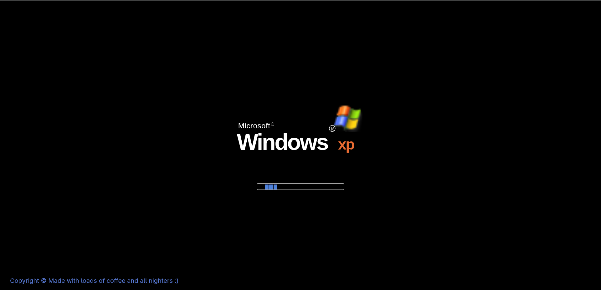
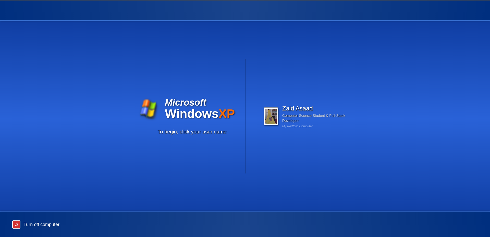
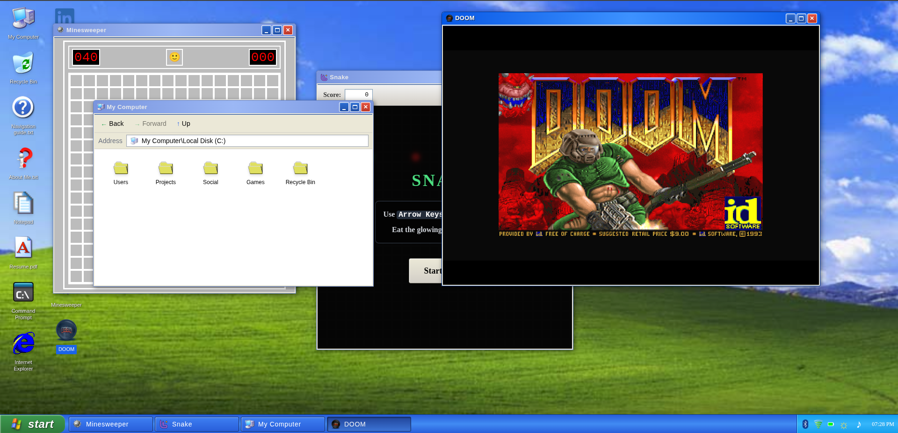

# Windows XP Themed Portfolio

### 🚀 [Live: zaid-7nl.pages.dev](https://db77a73b.zaid-7nl.pages.dev)

A fully interactive, web-based simulated Windows XP desktop experience serving as personal portfolio. Built with React, TypeScript, Tailwind CSS, and Vite.

## Features

- **Authentic Windows XP Interface:** Faithfully recreated UI, complete with the Bliss wallpaper, classic start menu, system tray, and draggable/resizable windows.
- **Simulated Boot Sequence:** Authentic BIOS and loading screens, followed by a classic login screen.
- **Virtual File System (VFS):** Navigate directories via a fully functional Windows Explorer replica.
- **Fully Working Applications:**
  - **Notepad:** View text files (like "About Me" and "Navigation Guide").
  - **Command Prompt:** Execute simulated commands.
  - **Browser:** Surf internal "sites" or external links.
  - **Control Panel:** Adjust simulated settings like brightness and volume.
- **Classic Games:** Play fully rebuilt versions of Snake and Minesweeper.
- **WebAssembly DOOM:** Launch and play the classic shareware DOOM directly in the browser.
- **Dynamic Sound System:** Authentic Windows XP startup, shutdown, and click sound effects powered by the Web Audio API.
- **Easter Eggs:** Hidden commands and a classic Blue Screen of Death (BSOD) trigger.

## Navigation Instructions

- **Booting Up:** Wait for the BIOS sequence to complete, or press `F1` / `Spacebar` to skip the boot animation, then click the profile on the Welcome Screen.
- **Opening Apps:** Double-click icons on the desktop or launch them via the Start Menu.
- **Window Management:** Click and drag title bars to move windows. Use the minimize, maximize, and close buttons on the top right.
- **File Explorer:** Use the "My Computer" icon to browse the Virtual File System. Double-click folders to dive deeper, and use the toolbar navigation buttons to go back/forward.
- **Games:** Open the games on the desktop by double-clicking on the icons or use the Start Menu to launch Snake, Minesweeper, or DOOM.

## Screenshots

### Boot Screen

### Login Screen

### Desktop Experience

